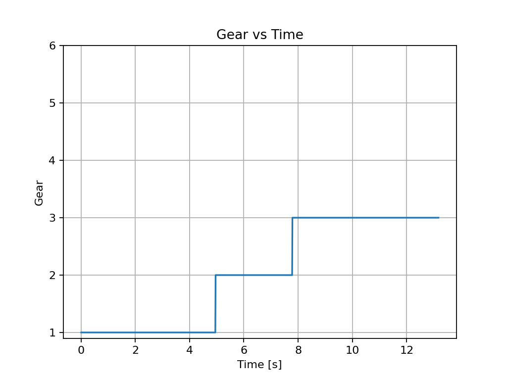
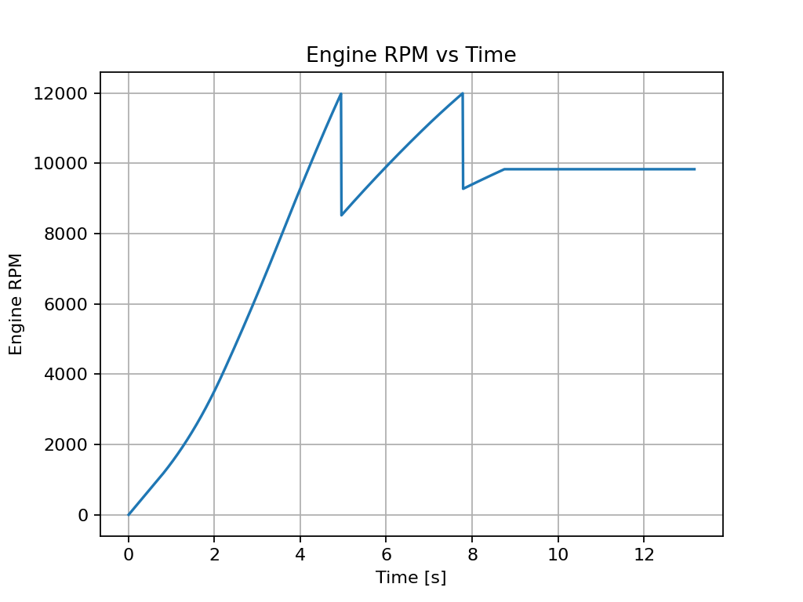

# Dev Log – Powertrain Integration (2025-08-26)

Yesterday I integrated a powertrain and gearbox model into the longitudinal simulation.  
Instead of a simple power-based force, the sim now uses a torque curve, gearbox ratios, and a shift strategy.  
This produces realistic acceleration traces with visible gearshift effects.

Key plots:
- **Gear vs Time** shows correct upshifts across six gears.
- **RPM vs Time** captures engine behaviour during acceleration.

  

Next steps:
- Experiment with different final drive and ratio sets to optimise acceleration.
- Extend the model with lateral dynamics (bicycle model).